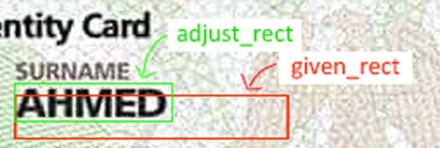

 # Image Crop & Adjust (Python)

**Image Crop & Adjust (Python)** is a lightweight Python library that automatically refines or expands a rectangular bounding box around dark text (or other dark regions) in an image. It uses a configurable approach—based on grayscale thresholding, tolerance around darkest pixels, and row/column scanning—to detect where the true boundaries should lie.



---

## Features

- **Easy Configuration**: Set threshold, search range, tolerance, and expansion ratio.
- **Row & Column Scanning**: Dynamically adjusts the bounding box by scanning for dark/light transitions.
- **Grayscale Conversion**: Converts your color image to a 2D grayscale array under the hood.
- **Minimal Dependencies**: Requires only [Pillow](https://pypi.org/project/Pillow/).

---

## Installation

1. Clone or download this repository.
2. In the root folder (where `setup.py` is located), run:

```bash
pip install .
```

This will install `crop_adjust` and its dependencies into your current Python environment.

---

## Usage

Below is a simple example demonstrating how to use **Crop Adjust**:

```python
from PIL import Image
from crop_adjust import CropAdjust

# 1) Create the CropAdjust object with default or custom configs
crop = CropAdjust(
    threshold=0.0,       # float: ratio threshold to decide dark vs. light row/col
    search_range=20,     # int: how far above/below we search for boundary
    tolerance=20,        # int: +/- range around darkest color to be considered "dark"
    expand_ratio=0.1     # float: how much to expand the final rectangle (10% each side)
)

# 2) Load an image (any format supported by Pillow)
img = Image.open("example.jpg").convert("RGB")

# 3) Convert image to a 2D grayscale array
image_data = crop.image_to_byte_array(img)

# 4) Provide an initial bounding box (x, y, width, height)
x, y, w, h = 190, 125, 172, 31
adjusted_rect = crop.fix_rect(image_data, x, y, w, h)

print("Original Rect :", (x, y, w, h))
print("Adjusted Rect :", adjusted_rect)
```

### Configuring

You can further tune parameters at runtime using setter methods:

```python
crop.set_threshold(0.05)
crop.set_search_range(30)
crop.set_tolerance(25)
crop.set_expand_ratio(0.12)
```

These control how aggressively the bounding box “locks onto” dark regions and how much padding to include.

---

## How It Works

1. **Grayscale Conversion**: We first convert the color image to a 2D grayscale array of shape \[width\]\[height\].
2. **Darkest Average Color**: Identify a baseline “dark” intensity within the given rectangle.
3. **Row/Column Scanning**: Move edges upward/downward or left/right until certain dark/light criteria are met. This helps “snap” the bounding box to the true content boundaries.
4. **Expansion**: Expand the final bounding box by a configurable ratio (e.g., 10%) as margin.

---

## Contributing

Contributions, bug reports, and feature requests are welcome!  
Feel free to open an issue or submit a pull request.

---

## License

This project is licensed under the [MIT License](LICENSE).
```

Simply place the above **`README.md`** file at the root of your project along with `sample_image.jpg` for the embedded image to display correctly.